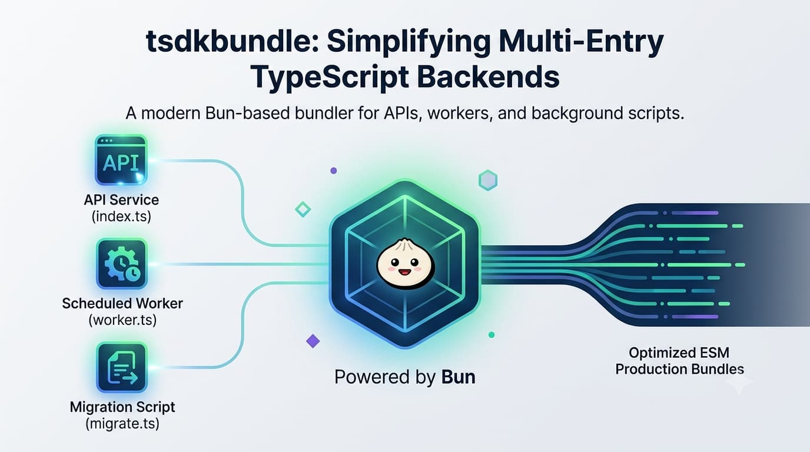

# tsdkbundle

[](LICENSE)
[](https://www.typescriptlang.org/)
[](https://github.com/tsdk-monorepo/tsdkarc/actions/workflows/ci.yml)

🇺🇸 English · [🇨🇳 中文](./README.zh-CN.md)

A Bun-based ESM bundler and watcher for multi-entry projects.



## 🚀 Quick Start

### 1. Install

> Ensure [Bun](https://bun.sh/) is installed on your system.

```bash
npm install -g tsdkbundle
```

### 2. Setup

Create `bundle.config.ts` in TS project:

```ts
// bundle.config.ts
import type { BundleConfigFn, BundleConfig } from "tsdkbundle";

export default (({ command }): BundleConfig => {
  const isProd = command === "build";

  return {
    default: ["backend"],
    projects: {
      backend: {
        target: "node",

        // 1. Define all entry files to be compiled independently
        entry: [
          "src/index.ts", // HTTP API entry point
          "src/worker.ts", // Async task worker entry point
          "src/scripts/migrate.ts", // Database migration script
        ],

        // 2. Specify the file to spawn as the main process in dev mode
        // Defaults to entry[0] if omitted
        main: "src/index.ts",

        outdir: "dist",
        sourcemap: isProd ? "none" : "linked",
        minify: isProd,
      },
    },
  };
}) satisfies BundleConfigFn;
```

### 3. Run

```bash
# Dev mode (auto-watch and restart)
bundle dev             # Run default projects
bundle dev backend     # Run only the 'backend' project

# Production build
bundle build           # Build default projects
bundle build backend   # Build only the 'backend' project
```

_(Note: If the command conflicts with Ruby's bundler, use `bb dev` instead)_

## 💡 Advanced Examples

### Custom tsconfig and External Modules

When building Node.js backends, native modules like `pg` and `bcrypt` usually shouldn't be bundled.

```ts
// bundle.config.ts
export default (): BundleConfig => {
  return {
    projects: {
      api: {
        target: "node",
        entry: ["src/api.ts"],
        tsconfig: "./tsconfig.server.json", // Specify a custom tsconfig
        external: ["pg", "bcrypt", "cors"], // Mark as external, do not bundle
      },
    },
  };
};
```

## ⚙️ `BundleConfig` Options

```ts
/** Configuration block for a single project. */
export interface ProjectConfig {
  /** Bun build target. Defaults to "node", use "browser" for frontend. */
  target?: "bun" | "browser" | "node";

  /** Entry file(s). String or array of strings. */
  entry: string | string[];

  /**
   * The entry file to spawn as the main process in dev mode (backend only).
   * Defaults to the first entry if not specified.
   */
  main?: string;

  /** Path to tsconfig.json for this project. Defaults to "tsconfig.json". */
  tsconfig?: string;

  /** Output directory. Defaults to "dist/<projectName>". */
  outdir?: string;

  /** .env file to load before starting the process. */
  envFile?: string;

  /** Packages to mark as external (not bundled). */
  external?: string[];

  /** Sourcemap mode. Defaults to "linked" in dev, "none" in build. */
  sourcemap?: SourcemapMode;

  /** Minify output. Defaults to false. */
  minify?: boolean;

  /** Additional directories to watch for changes. */
  watchDirs?: string[];

  /** Files or directories to ignore when watching. */
  ignore?: string[];

  /** Native Bun plugins to apply during the build step. e.g. [yamlPlugin()] */
  plugins?: BunPlugin[];

  /** Sets process.env.PORT when starting the dev process or frontend server. */
  port?: number | string;
}

/** Root config structure for bundle.config.ts */
export interface BundleConfig {
  projects: Record<string, ProjectConfig>;
  /** Default projects to run/build. */
  default?: string[];
}
```

## FAQ

**1. Why create this project?**

In TS-based backend development, independent bundling of sub-modules and multi-entry watch/run are essential. We used `nodemon`, then the CommonJS-only `nestjs/cli`. As ESM becomes the mainstream, we need a tool similar to `nestjs/cli` but with full ESM support. Bun is incredibly fast and provides a great experience, hence this tool.

**2. Why wrap Bun instead of using it directly?**

Bun already provides rich watch and bundle features out of the box. However, piecing together native commands for automated watching and batch bundling of **multi-entry projects** is tedious. This tool aims to solve this pain point in one step.

**3. What's the difference from nestjs/cli?**

`nestjs/cli` is an excellent tool, but its current ESM support is not ideal. This project natively embraces ESM.

**4. Does it support frontend projects?**

It supports bundling frontend code as an entry, but does not include heavy frontend dev features like HMR (Hot Module Replacement). For large frontend projects, Vite or Next.js is recommended. This tool currently focuses on backend TS projects.
